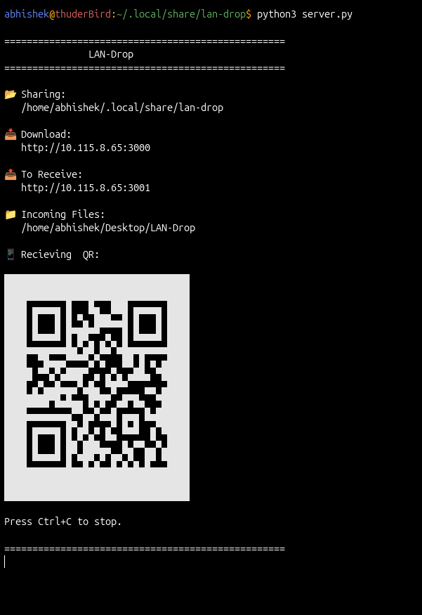
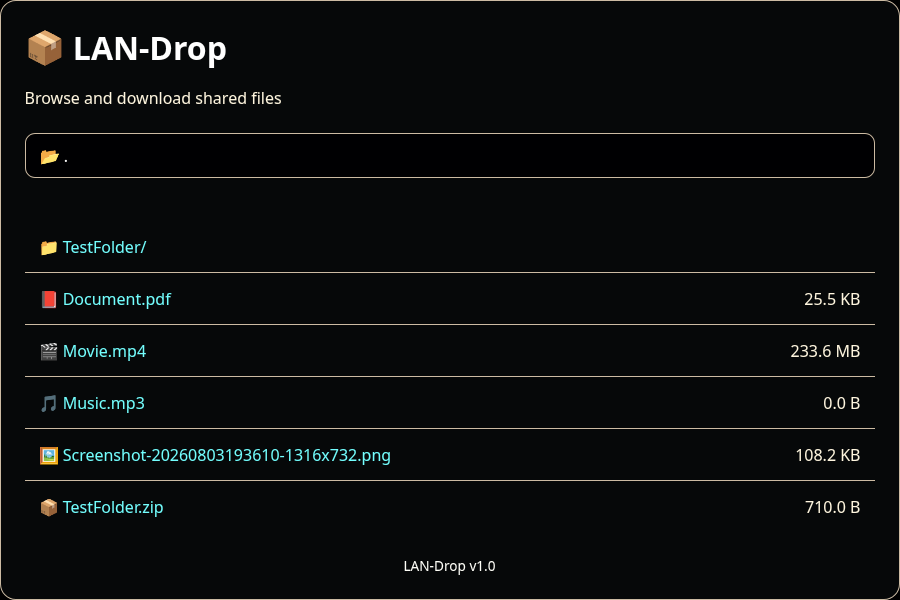
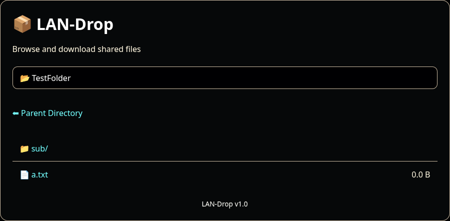
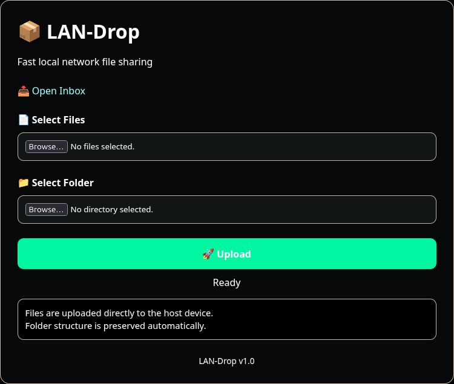
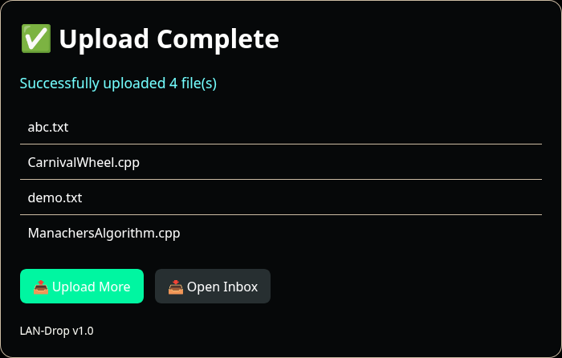
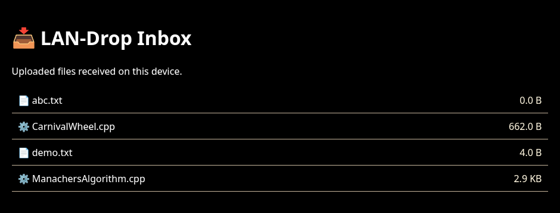

# LAN-Drop

A lightweight, cross-platform LAN file sharing tool built with Python.

LAN-Drop allows devices connected to the same local network to share files and folders through a simple web browser interface. No accounts, cloud services, or internet connection required.

---

## Features

### File Sharing

- Download files from the host device
- Upload files from phones, tablets, and computers
- Multiple file upload support
- Folder upload support
- Preserves folder structure during upload
- Automatic duplicate filename handling
- Great to run this on Host Linux Machine(works seamlessly)
- It will store Uploaded file on $USERS Desktop Directory

### Cross Platform

Works on:

- Linux
 - Windows
    - currently QR support is not available
- macOS

Access from:

- Android
- iPhone
- Linux
- Windows
- macOS

using any modern web browser.

### User Experience

- Mobile-friendly interface
- Upload progress bar
- QR code for quick access
- Upload inbox viewer
- Dark modern UI
- File size display
- Download directory browsing

### Logging

Displays useful terminal logs:

```text
[RECEIVING] movie.mkv from Android (192.168.1.105)

[DOWNLOADED] Linux.iso by Windows PC (192.168.1.121)
```

### Large File Support

Uses custom multipart implementation for multipart file handling.

Successfully tested with:

- Single files
- Multiple files
- Folder uploads
- Large audio files
- Large media files

---

## Screenshots

### Terminal Startup View

### Download Page




### Upload Page



### Upload Status



### Upload Inbox




---

## Requirements

### Software

- Python 3.10 or newer

### Python Dependencies

```bash
NONE
```

### QR Code Generation

Linux:

```bash
sudo apt install qrencode
```

---

## Installation

### Linux

Clone repository:

```bash
git clone https://github.com/Abhisheksinghchauhan192/Lan-Drop.git

cd lan-drop
```

Install dependency:

```bash
NONE
```

Install QR tool:

```bash
sudo apt install qrencode
```

Run:

```bash
python3 server.py
```

---

### Windows

Install Python from:

https://www.python.org/downloads/

Install dependency:

```powershell
NONE
```

Run:

```powershell
python server.py
```

Note:

QR code generation currently relies on the Linux `qrencode` utility and may require future Windows-specific support.

---

### macOS

Install Python:

```bash
brew install python
```

Install dependency:

```bash
NONE
```
Install qrcode:
```bash
brew install qrencode
```
Run:

```bash
python3 server.py
```

---

## Usage

Start LAN-Drop:

```bash
python3 server.py
```

Example output:

```text
==================================================
               LAN-Drop
==================================================

📂 Sharing:
   /home/user/Downloads

📥 Download:
   http://192.168.1.50:3000

📤 Upload:
   http://192.168.1.50:3001

📁 Incoming Files:
   /home/user/LAN-Drop
==================================================
```

Open the displayed URL from any device connected to the same network.

---

## Uploading Files

Open:

```text
http://HOST-IP:3001
```

You can:

- Upload a single file
- Upload multiple files
- Upload entire folders

Folder structure is preserved automatically.

Example:

```text
Project/
├── main.py
├── notes.txt
└── images/
    └── logo.png
```

Uploaded result:

```text
LAN-Drop/
└── Project/
    ├── main.py
    ├── notes.txt
    └── images/
        └── logo.png
```

---

## Downloading Files

Open:

```text
http://HOST-IP:3000
```

Features:

- Browse directories
- Download files
- Navigate folders
- View file sizes

---

## Project Structure

```text
lan-drop/

├── server.py
├── config.py
├── handlers/
│   ├── download.py
│   └── upload.py
│
├── templates/
│   ├── download.html
│   └── upload.html
│
├── utils/
│   ├── file_utils.py
│   ├── network.py
│   ├── qr.py
│   └── templates.py
│
├── uploads/
│
├── README.md
├── LICENSE

```

---

## Troubleshooting

### Cannot Access From Phone

Check:

- Both devices are on the same network
- Firewall is not blocking connections
- Correct IP address is being used

---

### Upload Fails

Verify:

```bash
DO not referesh page until Uploading Finishes.
```

---

### Folder Upload Not Working

Folder upload support depends on browser support.

Recommended:

- Chrome
- Edge
- Brave
- Opera

---

### QR Code Missing

Install:

```bash
sudo apt install qrencode
```

Current QR generation is implemented using the Linux `qrencode` utility.

---

## Security Notice

LAN-Drop is designed for trusted local networks.

Do not expose the service directly to the public internet.

---

## Future Plans

Potential future improvements:

- Native Windows QR support
- Native macOS QR support
- Drag and drop uploads
- Upload speed indicators
- Download progress indicators
- Archive download support
- User-configurable ports
- Device name detection
- Optional authentication

---

## License

Released under the MIT License.

See the LICENSE file for details.

---

## Author

**Abhishek Singh Chauhan**

Built as a practical networking and Python project to provide simple, fast, local network file sharing without relying on cloud services.
